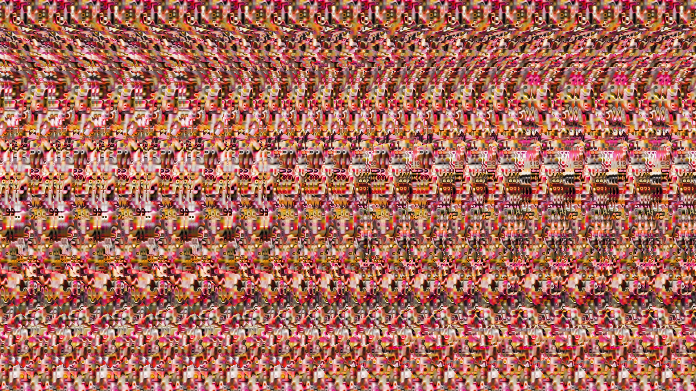
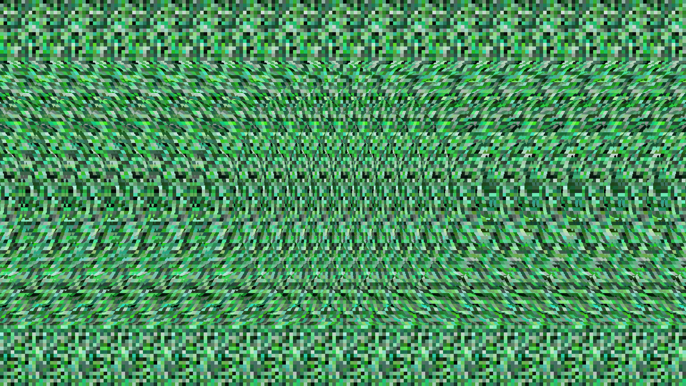

# Stereogram Generator

A browser-based tool for generating autostereograms (Magic Eye images) from depth maps.

## Features

- Load depth maps from presets, upload your own, or drag and drop
- Multiple pattern styles: checkerboard, gradient noise, warped noise, pixelated noise, curl noise, random dots, or a custom uploaded image
- Adjustable depth intensity, repeat count, and texture scale
- Invert depth toggle
- Resolution presets: 720p, 1080p, 1440p, 4K
- Fullscreen viewing mode
- Save output as PNG
- Progressive scanline rendering with live preview

## Usage

Open `index.html` in a browser. Load a grayscale depth map where white = near and black = far. Adjust the controls in the sidebar and click Regenerate for a new random pattern seed.

To view the hidden 3D image, use the **parallel viewing method**: relax your eyes and look *through* the screen as if focusing on something far behind it. The repeating pattern will shift and a 3D shape will emerge.

## How It Works

### Stereogram Principle

An autostereogram works by exploiting binocular vision. Your left and right eyes see slightly different horizontal positions. By repeating a pattern horizontally and shifting the repeat distance based on depth, each eye sees a slightly different offset, and your brain interprets the difference as depth.

- **Closer objects** get a smaller repeat distance (pixels shift together)
- **Farther objects** get a larger repeat distance (pixels shift apart)

### Algorithm

The renderer processes the image one scanline (row) at a time. For each row:

**1. Read depth values**

Each pixel's depth is read from the loaded depth map (0 = far, 1 = near). An optional invert toggle flips this mapping.

**2. Compute texture coordinates (bidirectional propagation)**

This is the core of the algorithm. We need to assign each pixel a texture coordinate such that pixels separated by the depth-adjusted gap get the *same* coordinate, creating the repeating pattern that encodes depth.

Two passes propagate coordinates across the row:

- **Left-to-right pass**: For each pixel, compute the gap to its linked neighbor one repeat to the left. The gap is `repeatSize - depth * maxSeparation`. The pixel copies its neighbor's coordinate and adds `repeatSize`. An iterative refinement (4 iterations) samples depth at the midpoint between the pixel and its neighbor to find the correct gap, since the gap itself depends on the depth at a position that depends on the gap.

- **Right-to-left pass**: Same process in reverse, propagating coordinates rightward.

The final texture coordinate for each pixel is the **average** of both passes. This eliminates the left-right bias that would occur from a single-direction pass, centering the depth displacement symmetrically.

**3. Map coordinates to pattern colors**

The averaged coordinate is mapped into the pattern's repeat period and fed to the selected pattern generator (noise function, checkerboard, custom image, etc.). The texture wrapping period is forced to an integer that evenly divides the repeat size, ensuring seamless tiling.

### Pattern Generation

Patterns are generated procedurally using:

- **Value noise** with smoothstep interpolation, wrapping horizontally to tile within the repeat period
- **Fractal noise** layering multiple octaves at halved amplitude and doubled frequency
- **Curl noise** computing the curl of a fractal noise field via finite differences, mapping direction to hue and magnitude to brightness
- **Warped noise** using one noise field to distort the domain of another, creating organic swirling patterns
