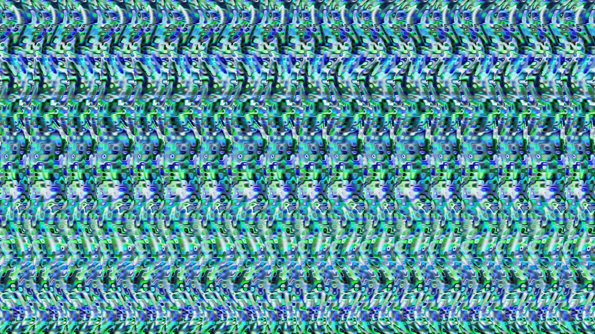
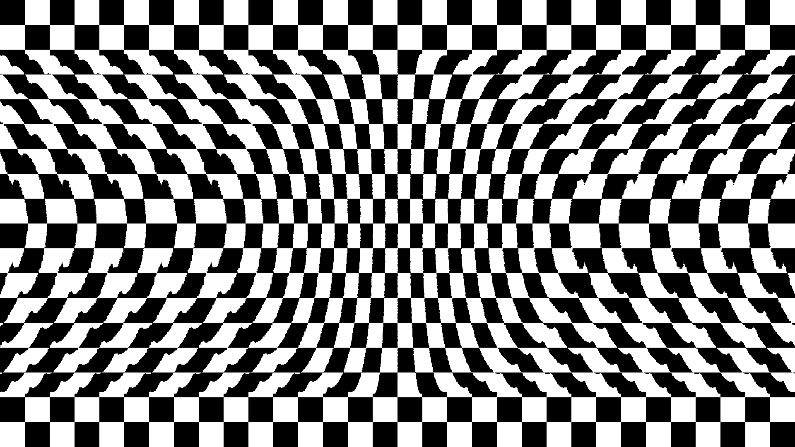

# Stereogram Generator

A browser-based tool for generating 3D autostereograms from depth maps.

## Features

- Load depth maps from presets or upload your own
- Multiple pattern styles or use a custom image
- Adjustable depth intensity, repeat count, and texture scale
- Invert depth toggle

## Usage

Load a grayscale depth map by selecting a preset or dropping your own file. Adjust the controls in the sidebar and click Regenerate for a new random seed.

To view the hidden 3D image, use the **parallel viewing method**: relax your eyes and look *through* the screen as if focusing on something far behind it. The repeating pattern will shift and a 3D shape will emerge.

## How It Works

An autostereogram exploits binocular vision. A pattern repeats horizontally, but the repeat distance varies based on depth. Each eye fixates on a different repeat of the pattern, and the brain interprets the offset as depth.

- **Closer objects** reduce the repeat distance (pixels shift together)
- **Farther objects** keep the base repeat distance (pixels shift apart)

The renderer processes each row independently. For each pixel it computes a depth-adjusted gap and propagates a texture coordinate from one repeat period to the next. Two passes (left-to-right and right-to-left) are averaged to keep the depth displacement symmetric. The final coordinate is mapped into a tiling pattern to produce the output color.

## Examples

